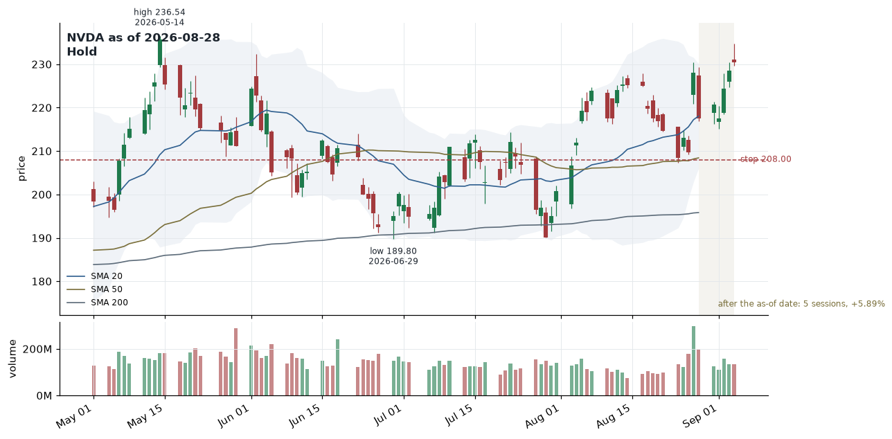

# Trading Cascade Manual

The words this exercise uses — from the markets, from the pipeline, and
from the jaato framework — the mechanisms the pipeline is built from, and
the argument for why they should produce a better answer than one model
asked once.

Written 2026-09-19 against main at `fb098bc`. Where a claim rests on a
measurement, the measurement is named; where it rests on a paper's claim or
on design intent, that is said too. `CLAUDE.md` is the operational
handover, `docs/assessment.md` the design rationale, `docs/gaps.md` the
dated findings; this document is the vocabulary and the argument.

## What this exercise is

A reimplementation of *TradingAgents* — a research framework in which
several language-model "agents" with different jobs analyse one instrument
on one date and arrive at a rating — rebuilt on the jaato SDK. Every agent
is a jaato *session*; a Python *driver* runs them in a fixed order and
passes each one's typed result to the next; market data reaches the model
through *tools* the driver hosts, never from the model's memory.

One run answers one question: **for this ticker, as of this date, what
rating?** A backtest asks it for many dates and grades each answer against
what the market did next. Nothing here places a trade.

## Market vocabulary

### Instruments, dates, bars

- **ticker** — the symbol an instrument trades under: `NVDA`, `SPY`,
  `BTC-USD`, as the data source spells it.
- **as-of date** — the date an analysis is "as of". Every data function
  refuses anything after it, so a run for 2026-08-28 sees the world as it
  was that day — the rule that makes a backtest honest.
- **OHLCV bar** — one session's open, high, low, close and volume. Daily
  bars are the only price data here; there is no intraday feed.
- **session vs calendar day** — a *session* is a day the exchange traded; a
  *calendar day* is a day. Indicator periods count sessions (a 20-day SMA is
  20 sessions); every tool's `lookback_days` counts calendar days.
  Confusing the two once quoted a May high as the "90-day high" in
  September.
- **close · high · low** — the session's last price and its extremes. The
  verified snapshot gives the window's high and low *with their dates*,
  because an undated low was twice cited under the wrong month.
- **stale bars** — price data whose newest bar is more than 7 calendar days
  before the date asked; refused with an unavailable-data sentence rather
  than quoted, since a listed stock trades at least once in any week.

### Indicators the market analyst may use

- **SMA 20 / 50 / 200** — simple moving averages of the close over 20, 50
  and 200 sessions: short, medium and long trend. Price above a rising
  average reads as an uptrend; the averages act as support.
- **EMA 10** — an exponential average weighting recent closes more; reacts
  faster than an SMA.
- **RSI 14** — relative strength index over 14 sessions, 0–100. Above 70 is
  conventionally "overbought", below 30 "oversold"; 52 is neutral. Wilder's
  method.
- **MACD 12/26/9** — EMA 12 minus EMA 26 (the line), its 9-session EMA (the
  signal), their difference (the histogram): momentum and its acceleration.
- **Bollinger 20/2** — SMA 20 with bands two standard deviations above and
  below. Price at the upper band is "extended"; narrow bands mean low
  volatility.
- **ATR 14** — average true range: the typical session's price range, in
  price units. Used to size stops ("2.7 ATR below entry").
- **VWMA 20** — volume-weighted moving average: a trend confirmed by volume.
- **verified snapshot** — the one block of numbers a report may quote as
  fact: last close, the window's high and low with dates, change, the
  moving averages, RSI, ATR, average volume, the last ten closes with
  dates. Computed in pandas from the bars; the analyst is told to quote it
  exactly.

### Reading a chart

- **bullish · bearish · neutral** — the analyst's *stance*: a bull expects
  the price to rise, a bear to fall, neutral sees no edge. A typed field
  with exactly those values, plus a *confidence* of low / medium / high.
- **support · resistance** — price levels where falls have stopped
  (support) or rises have stopped (resistance), often a moving average or
  a prior high. A **breakout** is a close *above* resistance; a close below
  the level is not one, however close.
- **momentum** — the rate at which price is moving; "expanding" when each
  move is larger than the last.
- **volatility** — how much price moves per session; ATR and the Bollinger
  width measure it.

### Decisions

The two judges rate on a five-step scale. The middle three are
*portfolio-relative*: a fund holds each instrument at some neutral weight,
and the rating says whether to hold more, the same, or less.

| rating | direction | meaning |
|---|---|---|
| Buy | +1 | get in |
| Overweight | +1 | hold more than neutral — expect it to beat the benchmark |
| Hold | 0 | keep the neutral weight |
| Underweight | −1 | hold less than neutral — expect it to lag |
| Sell | −1 | get out |

- **action** — the trader's vocabulary has only `Buy / Hold / Sell`, no
  tilts, which is why an Underweight recommendation becomes a Sell action:
  "reduce" has no nearer word.
- **entry price** — the price at which the trader proposes to open.
- **stop-loss** — the price at which the position is closed to cap the loss;
  the price gate checks it sits on the right side of the entry.
- **price target · time horizon** — where the position is expected to go,
  and by when.
- **position sizing** — how much of the portfolio to commit, often a risk
  fraction ("2 % portfolio risk").
- **risk stances** — the three risk debaters: *aggressive* argues for size
  and conviction, *conservative* for protection, *neutral* arbitrates.

### Measuring an answer

- **holding period** — how long a decision is held before scoring: 5
  sessions by default.
- **benchmark** — what a return is measured against: `SPY`, the S&P 500
  ETF. Beating the benchmark, not merely rising, is the bar.
- **return · alpha** — the instrument's holding-period return, and that
  minus the benchmark's (excess return). NVDA +5.89 % against SPY +0.11 %
  is alpha +5.78 %.
- **hit rate** — the share of cells whose rating pointed the right way:
  Buy/Overweight right when alpha > 0, Sell/Underweight when alpha < 0,
  Hold when |alpha| ≤ 1 %.
- **look-ahead bias** — letting an analysis see data from after its date.
  The as-of rule prevents it; fundamentals from a source without filing
  dates cannot be pinned, and the report says so.
- **backtest** — running the pipeline for many past dates and grading each
  against realised returns. *Walk-forward* would let lessons from earlier
  resolved decisions inform later ones; not offered yet.
- **determinism** — whether the pipeline gives the same answer to the same
  inputs. Measured, not assumed (see *Reading the numbers*).

## The pipeline, stage by stage

The order is the paper's team structure, written as control flow in the
driver. Each stage is one jaato session with its own persona; the driver
passes typed results forward.

```
analysts (market → sentiment → news → fundamentals; any subset)
   → bull ⇄ bear debate
   → research manager        research_plan
   → trader                  trader_proposal
   → risk debate             aggressive → conservative → neutral
   → portfolio manager       portfolio_decision (rating)
                             ↑ lessons from the decision log; records into it
```

1. **Analysts** — each a completion-gated session with its own host tools;
   the market analyst has price history, indicators and the verified
   snapshot. Output: an `analyst_report` with a stance and confidence. On
   historical dates only the market analyst has data: the news and social
   sources serve recent items.
2. **Bull ⇄ bear debate** — two long-lived sessions, one turn each per
   round; the driver relays only the opponent's last argument. Plain turns,
   no gate.
3. **Research manager** — reads the reports and the transcript; returns a
   `research_plan` with a recommendation on the five-step scale and
   warnings.
4. **Trader** — turns the plan into a `trader_proposal`: action, entry,
   stop, sizing, reasoning.
5. **Risk debate** — three sessions, aggressive → conservative → neutral,
   one turn each per round.
6. **Portfolio manager** — the final judge; returns the
   `portfolio_decision`: rating, thesis, target, horizon. Receives lessons
   from earlier resolved decisions on the same ticker.

Before the analysts, a **reflector** scores any earlier pending decision on
the ticker against realised returns and writes a lesson into the decision
log. After the portfolio manager, the decision is recorded as pending, the
report tree is written, and the journal is cleared.

## Mechanisms, and why each one

Each mechanism answers a specific way a single-shot model answer goes
wrong. Evidence from this repository's runs is cited where it exists.

- **Data is fetched, never remembered.** Prices reach the model only through
  tools, every function clamps to the as-of date, and the verified snapshot
  is the one block a report may quote as fact. A model's memory of "what
  NVDA does" is neither point-in-time nor checkable; a tool result is both.
  *Evidence:* every run since 2026-09-08 quotes the six snapshot figures
  exactly; when the snapshot mislabelled a window, the analyst faithfully
  repeated the wrong label — the data layer was the fault, and fixing the
  label fixed the reports.
- **Unavailable is a sentence, not a guess.** Every data failure returns text
  beginning `DATA_UNAVAILABLE` telling the model not to invent the value; an
  empty window says "quiet" instead, so a failed fetch and a quiet week are
  never confused. The instruction travels with the data because the model
  reads tool output as prose.
- **Specialised analysts.** Four analysts with four tool sets and four
  personas instead of one prompt with everything. Context is the scarce
  resource: a focused analyst reads its own evidence closely and reports it
  in a typed shape the next stage can trust.
- **Adversarial debate.** The bull and bear are told to argue their side
  *and* to concede when the evidence is against them; the research manager
  reads both, so counter-evidence surfaces before a judge rules. *Evidence:*
  on 2026-09-13 and 09-14 the research manager's warnings named the market
  report's contradiction — a "breakout above 236.54" while the close was
  230.36 — and the rating went to Hold; neither judge invented a
  reconciliation.
- **Typed decisions that can refuse.** Every stage ends by calling
  `signal_completion` with a payload that must match a strict schema, and
  every schema carries `errors[]` and `warnings[]`. An agent may say "I
  could not answer" and the driver stops the run rather than parse a rating
  out of prose. A missing decision is a stopped run, never a default Hold.
- **Gates on the model's output.** Completion processors are pure functions
  over the payload: the analyst gate refuses a report too thin to argue
  from or one that names no tools; the price gate checks the trader's entry
  and stop against the verified range. A refused completion is handed back
  with the reason, at most twice.
- **Determinism where it can be bought.** `temperature: 0.0` on every stage,
  a fixed DAG, verified numbers, the same personas. What this buys is
  measured: the data layer is deterministic and the judgement agrees with
  itself three times in five.
- **Ceilings.** Every stage carries a `budget_control` — dollars, tool
  calls, seconds, turns — with an abort at 100 %. A stage that loops stops,
  the run fails by name, the journal keeps everything before it.
- **Journal and resume.** Each stage's result and each debate turn is
  journaled as it lands; a re-run skips what is already there. A run
  interrupted at the last stage costs one stage to finish, not six.
- **Memory scored against reality.** The decision log records each rating
  as pending and resolves it after the holding period against realised
  returns; the reflector writes a lesson, and later runs read only lessons
  resolved *before* their as-of date. The loop learns from outcomes, and it
  is point-in-time.
- **Evaluation as a first-class mechanism.** A backtest is a sweep of driver
  runs graded by a deterministic scorer — no model judges its own call.
  This is the mechanism that decides whether the others were worth
  building.

## jaato vocabulary

- **daemon** — the long-running server that owns sessions. The driver talks
  to it over a Unix socket, never in-process — only the daemon honours the
  whole profile contract (gates, ceilings, spawn validation).
- **session** — one agent conversation with a provider: a model, a persona,
  tools, a budget. Each stage is one; the debaters keep theirs open across
  turns.
- **profile · profile set** — a YAML file naming a stage's determinism:
  plugins, schemas, gates, ceilings. `_base_<agent>.yaml` is
  provider-agnostic; `<set>/<agent>.yaml` binds provider and model and
  inherits the base. The set is chosen by `JAATO_PROFILE_SET` in the
  workspace `.env`. Two ship: `openrouter_sonnet` and `echo`.
- **inheritance rules** — `plugins` union (a child cannot remove);
  `completion_processors` concatenate; `budget_control.limits` min-wins (a
  child may only tighten); scalars child-replaces; `description` does not
  inherit.
- **persona · agent_params** — the system prompt for a stage,
  `.jaato/agents/<name>.md`, with `{{param}}` substitutions. Params must be
  strings and are validated against a `spawn_payload_schema` at session
  creation.
- **completion payload · signal_completion** — the typed result of a gated
  stage. The schema *is* the tool's parameters; the daemon re-prompts an
  agent that stops in prose without signalling, up to a nudge budget.
- **completion processor** — a gate: `validate(payload, context)` returns
  errors that block the completion and are handed to the model; `render`
  writes a report section. `max_refusals: 2` bounds the loop.
- **ask() · complete()** — the two ways to drive a session. `complete()`
  waits for the session to settle on its completion and returns the
  payload — for gated stages. `ask()` returns one turn's text — for
  debaters. Mixing them up hangs or returns half-finished work.
- **SessionEnded · terminus** — what `ask()` raises when a session ends under
  the turn it was driving (a budget stop, a cancelled cascade), with the
  daemon's reason; `Session.terminus` carries the same for `complete()`.
  Before jaato #1007 a budget-cut debater turn came back as empty text and
  the next call hung forever.
- **budget_control** — per-session ceilings on `usd`, `tokens`, `seconds`,
  `tool_calls`, `turns`, and a `degrade` ladder whose rungs act — here,
  `abort` at 100 %. Limits alone are observed, never enforced; the rung
  enforces.
- **cascade · cascade_driver_id** — a set of sessions that belong to one run,
  stamped with one id. They share a warm runner slot; an observer can watch
  the whole run by that id; a pool can budget it as a whole.
- **observer** — a second connection that receives a cascade's events without
  driving it. The live board is one; jaato-eval's accounting of a driver
  arm is another.
- **host tools · client_tools** — functions that live in the driver's process
  and are offered to the model as tools; the daemon calls back over the
  socket. Market data reaches the model this way. They exist only while the
  driver is attached.
- **prefetch** — a persona placeholder that runs a script *inside the
  runner* at session start; the sentiment analyst's four-source fetch. Must
  be bounded: a slow prefetch is a failed session.
- **echo provider** — the framework's deterministic test double: canned
  reply, one canned tool call, mandatory usage figures. Zero cost, no
  credentials; the whole pipeline runs on it in the tests.
- **explain · validate · doctor** — `jaato-scaffold explain` is the
  framework describing itself and is the source of truth over its source
  code; `validate` checks a profile set against the installed framework;
  `jaato-doctor` checks the daemon, socket, secrets and integrations.
- **pass://** — a secret URI resolved daemon-side from the `pass` store. The
  OpenRouter key is one; it lives in no file beside the workspace.
- **journal · decision log** — driver products under `.ta_cascade/`, never
  under `.jaato/` (the framework's config root and runtime state).

## Backtests and jaato-eval

jaato-eval is the framework's sweep engine: a task manifest becomes many
runnable *arms* across a matrix, each in its own scratch workspace, graded
and written to a results file as it lands. This repository was the first
to need an arm that is a whole driver run rather than one session; jaato
#1110 designed it and #1112 shipped it.

- **task · task.yaml** — one cell of a matrix: for a backtest, one (ticker,
  date). `python -m ta_cascade backtest-tasks` writes them.
- **arm** — one execution of a task under one profile set, one repeat:
  `tasks × profile sets × repeats`.
- **harness.kind: driver** — an arm that is a process the engine starts —
  this driver — instead of a session the engine opens. The engine hands it
  a versioned *contract* as environment (`JAATO_EVAL_WORKSPACE`,
  `CONFIG_ROOT`, `SOCKET`, `CASCADE_ID`, `PYTHON`, the params) and reads its
  exit code: 0 gradeable, 75 the environment failed (BLOCKED), anything
  else stopped short.
- **grader · verdict** — a `script` grader runs a command in the arm's
  workspace; here `python -m ta_cascade.score`. Verdicts are **PASS**,
  **FAIL** or **BLOCKED** — the last meaning "nothing was learned about the
  configuration", kept out of the pass-rate denominator.
- **scorer** — reads the cell's `state.json`, fetches the realised returns
  for instrument and benchmark, applies the direction rule. Its facts —
  rating, returns, alpha, verdict — are kept verbatim in each verdict's
  `evidence`.
- **repeats** — arms per cell. Five on one cell is a determinism study.
- **pool** — a cascade-wide budget for a task's arms. Not used here: every
  stage carries its own ceiling, and a session with one never draws on a
  pool.
- **resume · concurrency · arm timeout** — skip arms already in the results
  file; run several at once (memory on this host allows one); kill an arm
  at a wall-clock ceiling and record it BLOCKED.

## Why this is expected to work

Three layers of reason, in decreasing strength.

**Established by measurement here**

- The mechanics hold: budgets abort by name, runs resume, the driver runs
  as a sweep arm, the scorer grades. 98 unit tests and 3 end-to-end tests
  exercise them on the echo double; live runs on Sonnet have finished
  cleanly since 2026-09-08.
- The data layer is deterministic and faithful: identical figures across
  five repeats; verified numbers quoted exactly; a mislabelled window was
  the one time reports were wrong about a price, and the fix removed the
  error from the next live report.
- The debate and the judges catch contradictions in the analyst's report
  rather than pass them through.

**What the design argues**

- Separating *facts* (tools, snapshot, gates) from *judgement* (personas,
  debate) means the model can be wrong only about interpretation, never
  about what the price was. Most of the damage a single-shot answer does is
  invented fact.
- Specialisation and adversarial structure are how human research desks
  are organised, for the same reason: focused evidence, then argument, then
  a judge who did not gather the evidence.
- Typed refusal beats silent invention: a stopped run is visible, a
  fabricated Hold is not.

**What the reference framework claims**

The TradingAgents paper reports that its multi-agent framework beat
rule-based baselines (buy-and-hold, moving-average and momentum rules) on
cumulative return and risk-adjusted return in its own backtests — over a
short window and a handful of large tickers. That is the source's claim,
not a result reproduced here, and this reimplementation shares the
architecture, not the prompts or code.

> **What is not yet known is whether the ratings have predictive value.**
> No backtest over many dates has run. The first measurement of the
> judgement layer says it agrees with itself 3 times in 5 on identical
> inputs; a pilot's hit rate has to be read against that, and against the
> cost of a cell.

## Reading the numbers

### The determinism study, NVDA 2026-08-28 × 5

| arm | market stance | research manager | trader | rating | cost | time |
|---|---|---|---|---|---:|---:|
| 0 | bullish (medium) | Hold | Hold | Hold | $0.77 | 328 s |
| 1 | neutral | Hold | Hold | Hold | $0.92 | 337 s |
| 2 | neutral | Underweight | Sell | Underweight | $0.81 | 394 s |
| 3 | neutral | Underweight | Sell | Underweight | $0.86 | 384 s |
| 4 | neutral | Hold | Hold | Hold | $0.79 | 314 s |

Same report numbers in all five (close 217.55, RSI 52.34, the same three
tool calls). Rating agreement 3 of 5. The following five sessions: NVDA
+5.89 %, SPY +0.11 %, alpha +5.78 % — every arm was wrong, the Holds on the
band and the Underweights on the sign. One cell; no verdict on the
strategy.

### Scales to keep in mind

- **a market-only run** — 9 sessions, 5–7 minutes, $0.77–1.41 on Sonnet via
  OpenRouter; the two full-analyst runs so far were roughly double.
- **hit rate** — against 60 % self-agreement, one run per cell measures
  rating noise as much as signal: either repeat cells or read a pilot with
  that noise in mind.
- **what a backtest can honestly include** — the market analyst. News and
  social sources serve recent items only, so on historical dates the other
  analysts see nothing.
- **the account** — OpenRouter credit is shared with other clients on this
  host; per-stage spend is identifiable in the activity export by app title
  (`Trading - <agent> (powered by Jaato)`), not from the account total.

## Reading the chart

Every finished run draws its recommendation on the data it was made from:
`results/<ticker>/<date>/chart.png`, linked from `report.md`. It is drawn
by code, after the decision, from the same bars the verified snapshot comes
from; the model never sees it. It exists so a reader can check the prose
against the picture in seconds.



*NVDA as of 2026-08-28, arm 0 of the determinism study: a real Sonnet
decision with a known outcome.*

### What is on it

- **Candles** — one per session. Green closed at or above its open, red
  below; the thin line is the session's range, the thick body runs from
  open to close. A tall body on a tall volume bar is a session that
  mattered.
- **The three lines** — SMA 20 (blue), SMA 50 (olive), SMA 200 (grey). Price
  above all three with the lines stacked 20 over 50 over 200 is the
  "positively aligned" uptrend the reports name. A line under the price
  acts as support; here the 50-day sits at 208, which is where the trader
  put the stop.
- **The shaded band** — Bollinger, two standard deviations around the
  20-session average. Price riding its upper edge is "extended"; the band
  widening means volatility rising.
- **Volume**, in millions, coloured like its candle. A red candle on the
  tallest bar right after a green one — Aug 27 → Aug 28 here — is the
  "failed breakout on massive volume, then a 4.6 % reversal" the decision
  cites.
- **The dated labels** — the span's highest high and lowest low, with their
  dates: the levels the prose calls "the May high" (236.54, 2026-05-14)
  and "the June low" (189.80, 2026-06-29). Any other level the text names
  ("resistance at 225") is the analyst's choice and is not drawn.
- **The horizontal lines** — the trader's entry (solid), stop (dashed red)
  and the portfolio manager's target (dashed green), when the payloads
  carry them. A Hold has no entry, and this portfolio manager withheld a
  target, so only the stop is drawn.
- **The corner** — ticker, as-of date, final rating.
- **The shaded span at the right** — the sessions *after* the as-of date,
  drawn only when they exist (a backtest cell), with their count and
  return. Those bars never reached the model; they are what came next.

### Reading this one

*What the pipeline saw on 2026-08-28:* price at 217.55, above all three
averages and with them stacked in trend order — but the day before had
been a breakout attempt to 227.98 on the span's heaviest volume,
immediately reversed. Momentum had rolled over (RSI down to 52, MACD
crossing below its signal), and from 217.55 the nearest support (208) was
4.3 % away while the nearest resistance was 3.5 % away.

*What it decided:* the analyst read the technicals as bullish with medium
confidence; the research manager weighed the failed breakout and the
risk/reward and recommended Hold; the trader agreed, keeping a stop at
208 for anyone already in; the portfolio manager rated **Hold**.

*What happened:* the shaded span. Five sessions on, the close was 230.36 —
+5.89 % against SPY's +0.11 %. Price never came near the stop.

*How the scorer read it:* a Hold is right when the excess return stays
within ±1 %; this was +5.78 %, so **FAIL**. The call was defensible on the
picture — the reversal candle is real, the risk/reward was as stated —
and wrong in outcome. One cell says nothing about the strategy; it says
what a reader can now see at a glance.

### Two cautions

- The chart is *output*. Nothing the pipeline reasoned about came from a
  picture; it reasons from the snapshot's numbers, and the chart is drawn
  from the same numbers afterwards.
- A chart that could not be drawn (no bars, a fetch that failed) is logged
  and the report carries no link; the decision stands.

Sources: `CLAUDE.md`, `docs/assessment.md`, `docs/gaps.md`, the completion
schemas under `.jaato/completion_schemas/`, jaato issues #1007, #1110,
#1112, #1127, and `backtests/determinism/results.jsonl`.
